# SKÅDIS Build Plate Holder
This is a customizable build plate holder for the IKEA SKÅDIS pegboard system.

## Gallery
<figure><a href=stls/skadis_120mm_2.stl>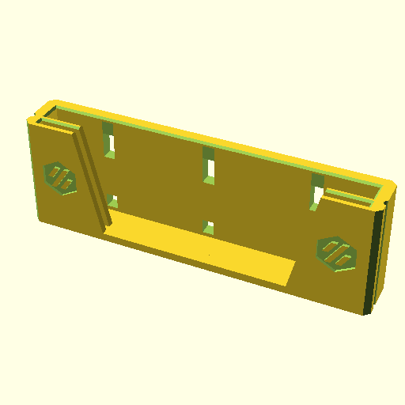</a> <figcaption>skadis_120mm_2</figcaption></figure>
<figure><a href=stls/skadis_120mm_3.stl>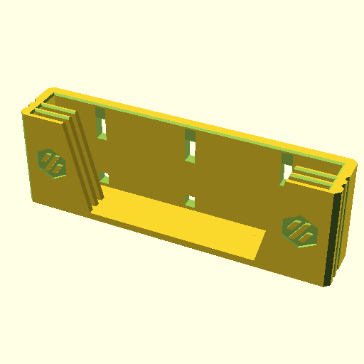</a> <figcaption>skadis_120mm_3</figcaption></figure>
<figure><a href=stls/skadis_120mm_4.stl>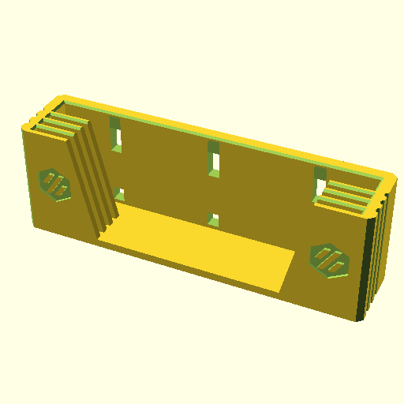</a> <figcaption>skadis_120mm_4</figcaption></figure>
<figure><a href=stls/skadis_120mm_5.stl>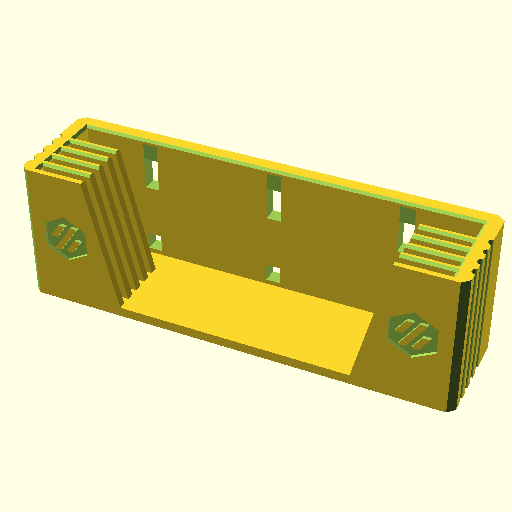</a> <figcaption>skadis_120mm_5</figcaption></figure>
<figure> <figcaption>skadis_250mm_2</figcaption></figure>
<figure><a href=stls/skadis_250mm_3.stl>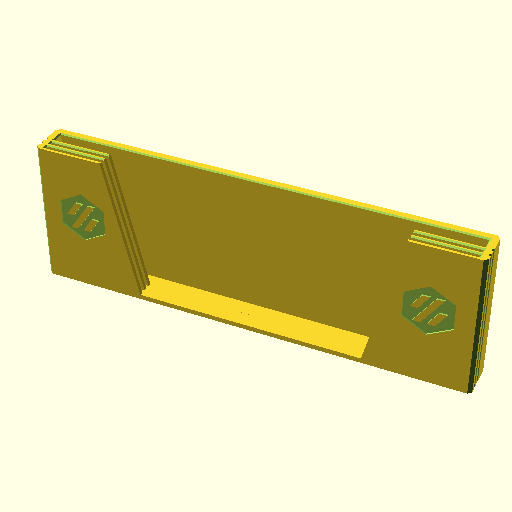</a> <figcaption>skadis_250mm_3</figcaption></figure>
<figure> <figcaption>skadis_250mm_4</figcaption></figure>
<figure><a href=stls/skadis_250mm_5.stl>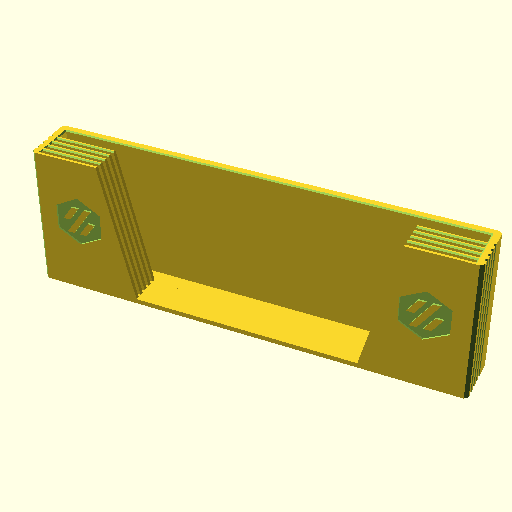</a> <figcaption>skadis_250mm_5</figcaption></figure>
<figure> <figcaption>skadis_300mm_2</figcaption></figure>
<figure> <figcaption>skadis_300mm_3</figcaption></figure>
<figure><a href=stls/skadis_300mm_4.stl>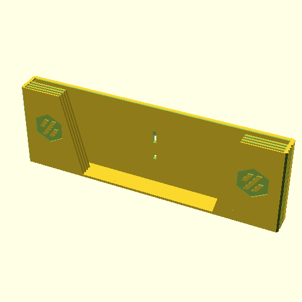</a> <figcaption>skadis_300mm_4</figcaption></figure>
<figure><a href=stls/skadis_300mm_5.stl>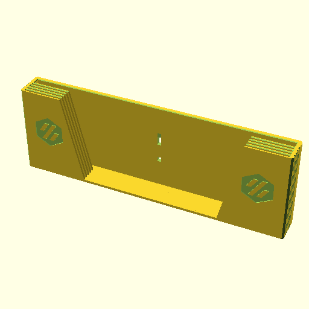</a> <figcaption>skadis_300mm_5</figcaption></figure>
<figure><a href=stls/skadis_350mm_2.stl>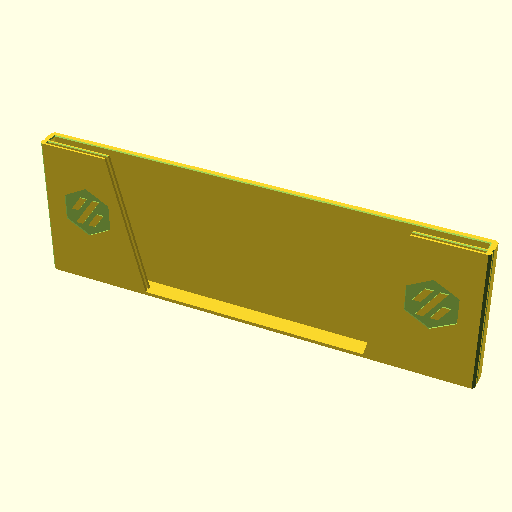</a> <figcaption>skadis_350mm_2</figcaption></figure>
<figure><a href=stls/skadis_350mm_3.stl>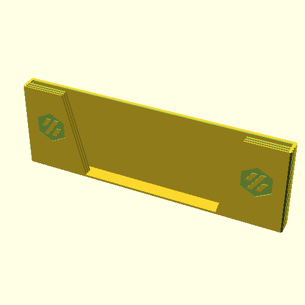</a> <figcaption>skadis_350mm_3</figcaption></figure>
<figure><a href=stls/skadis_350mm_4.stl>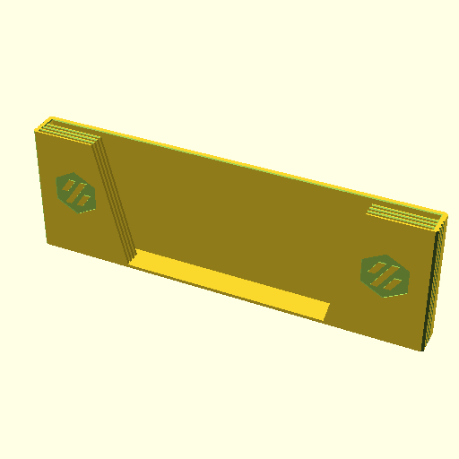</a> <figcaption>skadis_350mm_4</figcaption></figure>
<figure> <figcaption>skadis_350mm_5</figcaption></figure>
<figure><a href=stls/standing_120mm_2.stl>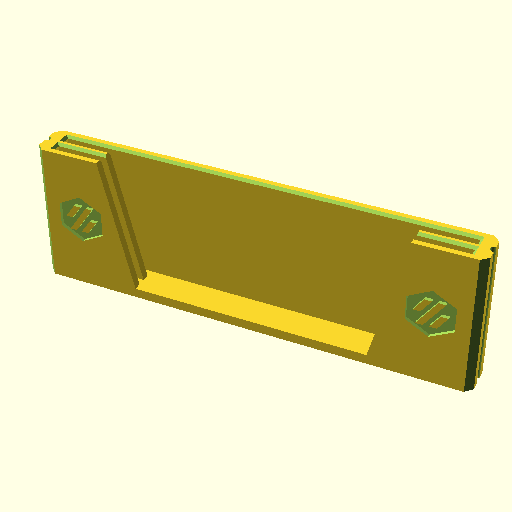</a> <figcaption>standing_120mm_2</figcaption></figure>
<figure><a href=stls/standing_120mm_3.stl>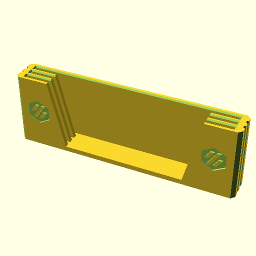</a> <figcaption>standing_120mm_3</figcaption></figure>
<figure><a href=stls/standing_120mm_4.stl>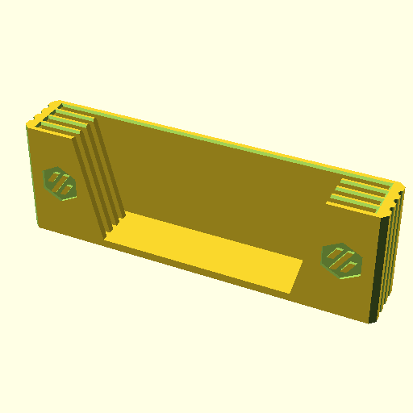</a> <figcaption>standing_120mm_4</figcaption></figure>
<figure> <figcaption>standing_120mm_5</figcaption></figure>
<figure> <figcaption>standing_250mm_2</figcaption></figure>
<figure> <figcaption>standing_250mm_3</figcaption></figure>
<figure><a href=stls/standing_250mm_4.stl>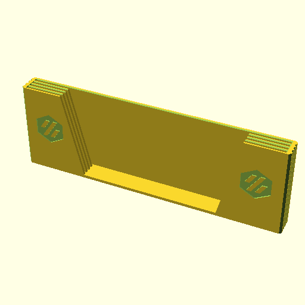</a> <figcaption>standing_250mm_4</figcaption></figure>
<figure> <figcaption>standing_250mm_5</figcaption></figure>
<figure> <figcaption>standing_300mm_2</figcaption></figure>
<figure> <figcaption>standing_300mm_3</figcaption></figure>
<figure> <figcaption>standing_300mm_4</figcaption></figure>
<figure><a href=stls/standing_300mm_5.stl>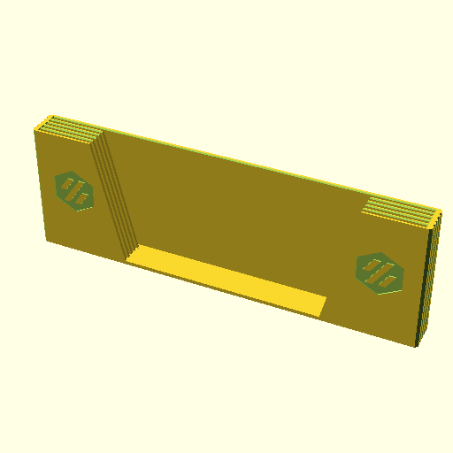</a> <figcaption>standing_300mm_5</figcaption></figure>
<figure><a href=stls/standing_350mm_2.stl>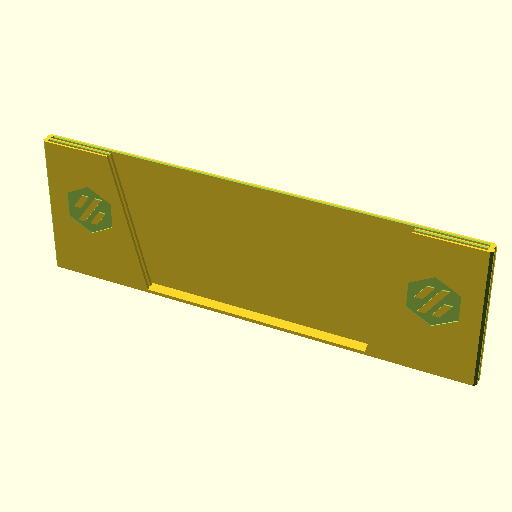</a> <figcaption>standing_350mm_2</figcaption></figure>
<figure><a href=stls/standing_350mm_3.stl>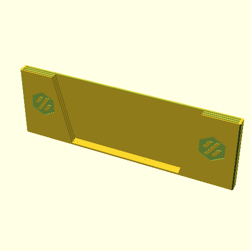</a> <figcaption>standing_350mm_3</figcaption></figure>
<figure> <figcaption>standing_350mm_4</figcaption></figure>
<figure><a href=stls/standing_350mm_5.stl>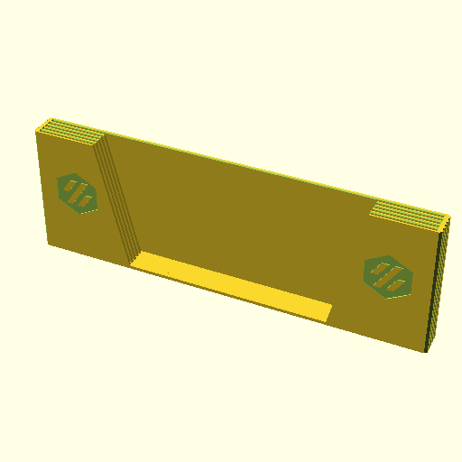</a> <figcaption>standing_350mm_5</figcaption></figure>
